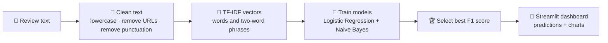

# 💬 Sentiment Analysis System

> Turn customer reviews into an instant **Positive** or **Negative** sentiment prediction.

This beginner-friendly NLP project cleans review text, turns words into numbers with TF-IDF, compares machine-learning models, and presents the results in an interactive Streamlit dashboard.

## What you can do

| Action | What happens |
| :--- | :--- |
| ✍️ Analyze one review | Paste text and receive a sentiment label with confidence. |
| 📁 Analyze a CSV | Upload many reviews and download predictions as a new CSV. |
| 📊 Explore the data | See sentiment balance, review length, key terms, and model quality. |
| 🧠 Train again | Replace the demo data with your own labeled dataset and retrain. |

---

## How it works



### In plain English

1. A review such as *“The delivery was fast and the product is excellent”* is cleaned into consistent text.
2. **TF-IDF** measures which words and phrases matter most. Words common to every review matter less; distinctive terms such as “excellent” or “damaged” matter more.
3. Two classifiers learn patterns from labeled examples: `1 = Positive` and `0 = Negative`.
4. The project chooses the model with the strongest **F1 score**, then saves it for dashboard predictions.

---

## Dashboard guide

| View | What it helps you understand |
| :--- | :--- |
| **Analyze text** | The likely sentiment of a single review and how confident the model is. |
| **Batch analysis** | Sentiment for every row in an uploaded CSV that contains a `text` column. |
| **Sentiment distribution** | Whether your training data has more positive or negative examples. Balanced data usually gives fairer predictions. |
| **Review-length distribution** | Whether positive and negative reviews tend to be short or detailed. |
| **Model comparison** | Which model has the higher F1 score. F1 balances catching positive reviews with avoiding incorrect positives. |
| **Confusion matrix** | Where the chosen model is correct and where it mixes up positive and negative examples. |
| **Distinctive terms** | Words and phrases that appear most strongly in each sentiment class. |

### Reading the confusion matrix

```text
                    Predicted
                 Negative   Positive
Actual Negative     ✅          ⚠️
       Positive     ⚠️          ✅
```

- The diagonal ✅ cells are correct predictions.
- The off-diagonal ⚠️ cells are mistakes. Fewer mistakes means a better model.

---

## Quick start

### 1. Create an environment and install packages

```bash
python -m venv .venv
source .venv/bin/activate  # Windows: .venv\Scripts\activate
pip install -r requirements.txt
```

### 2. Train and evaluate models

```bash
python train.py
```

This creates:

```text
models/sentiment_pipeline.joblib  ← saved best model
reports/model_comparison.csv      ← accuracy and F1 by model
reports/evaluation.json           ← detailed evaluation and confusion matrix
```

### 3. Start the dashboard

```bash
streamlit run app.py
```

Open the address Streamlit prints, usually [http://localhost:8501](http://localhost:8501).

---

## Use your own data

The included file is a small offline demonstration dataset. For a meaningful model, train on a larger collection such as the [UCI Sentiment Labelled Sentences dataset](https://archive.ics.uci.edu/dataset/331/sentiment+labelled+sentences).

Your CSV must contain these fields:

| Column | Required | Description | Example |
| :--- | :---: | :--- | :--- |
| `text` | Yes | Review, feedback, or sentence | `The product arrived early` |
| `label` | Yes | `0` for negative, `1` for positive | `1` |
| `source` | No | Origin or category | `product` |

Example:

```csv
text,label,source
"The support team fixed my issue quickly",1,service
"The item stopped working after a day",0,product
```

Replace `data/sentiment_reviews.csv`, delete `models/sentiment_pipeline.joblib`, and run `python train.py` again.

---

## Project structure

```text
├── app.py                   # Streamlit dashboard and visual analysis
├── sentiment_model.py       # Cleaning, training, saving, and prediction
├── train.py                 # Command-line training and report generation
├── data/
│   └── sentiment_reviews.csv # Labeled review data
├── models/                  # Generated saved model
├── reports/                 # Generated evaluation results
└── tests/                   # Preprocessing and inference checks
```

## Important limitations

- This is a **binary** model: it does not label neutral sentiment.
- Sarcasm, mixed opinions, emojis, and highly domain-specific terms can be difficult to classify.
- Confidence is the model’s estimated probability, not a guarantee.
- The demo dataset is intentionally small; replace it before reporting final model performance.

## Ideas to extend the project

- Add a **Neutral** class for three-way sentiment analysis.
- Show sentiment trends by date when a dataset includes timestamps.
- Compare against a Support Vector Machine or transformer model.
- Deploy the Streamlit application online.
